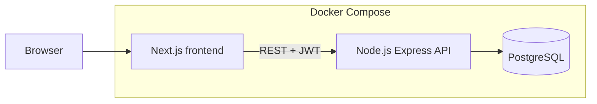
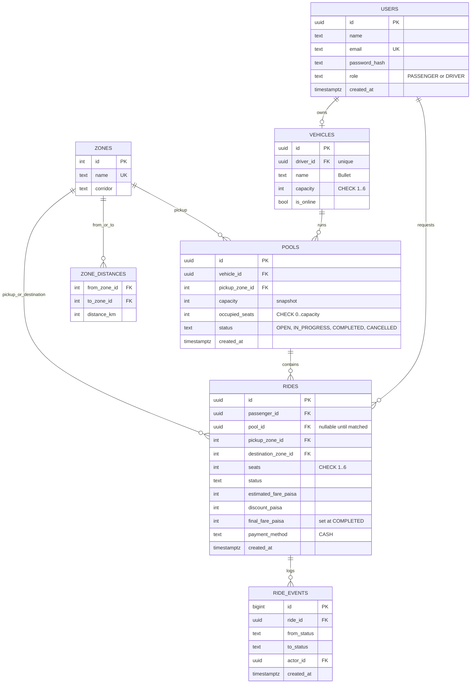

# Dhaka Tesla Pool

Share a seat. Split the fare. Survive Dhaka traffic.

> **Demo video (6 min):** TODO: paste Loom link here
> **Live deployment:** TODO: paste URL, or see [Deployment](#deployment)
> **Release:** `release/v1.0.0` (tag `v1.0.0`)

## Summary

Dhaka Tesla Pool is a ride-pooling MVP for three-seat battery "Teslas". Passengers request a ride between two Dhaka zones. When two requests are compatible, they share one Tesla and split the fare, each paying an individual, discounted amount. The driver sees who is in the pool and moves the trip through its stages. Every status change is stored, so a finished ride can be explained later.

The story cast is used everywhere (seed data, tests, demo):

| Role | Name | Story |
|---|---|---|
| Driver | Jashim | Owns Bullet, a 3-seat Tesla |
| Passenger | Nusrat | Banani to Mohakhali, 1 seat |
| Passenger | Rafiq | Banani to Gulshan 1, 1 seat |
| Passenger | Shirin | Tries to claim the last seat |

## Problem statement

Nusrat and Rafiq leave from the same place, going to nearby destinations. The system must decide whether they can share Bullet, give each an individual fare, never put more people in Bullet than it has seats, and keep enough history to explain what happened. When Nusrat and Shirin race for the last seat, exactly one of them gets it.

## Features

**Passenger**
- Sign up and sign in
- Request a ride: pickup zone, destination zone, seats
- See the estimated fare before and after matching
- Track status: REQUESTED, MATCHED, DRIVER_ARRIVED, STARTED, COMPLETED or CANCELLED
- Cancel while the ride is still cancellable
- View ride history (own rides only)

**Driver**
- Sign in, register a Tesla with fixed capacity, go online or offline
- See open ride requests and accept one
- See the current pool: passengers, seats, status
- Mark arrived, start and complete
- View history of finished pools

**Pool and fare**
- Several requests can share one Tesla
- Occupied seats never exceed capacity (enforced in the transaction and in the database)
- Each passenger has an individual fare
- Every ride status change is recorded in `ride_events`

## Screenshots

TODO: add screenshots or GIFs: passenger request, driver dashboard with Nusrat and Rafiq in Bullet, Shirin's "no seats" error.

## Architecture



One API and one database, with no queues or caches. Business rules (state machine, matching, fare, capacity) live in the API service layer, not in route handlers and not in the frontend.

Backend layers: routes (HTTP and zod validation), then services (rules and transactions), then repositories (SQL). Auth middleware reads the JWT and attaches the user id and role. Ownership checks happen in services.

More detail: [docs/03-architecture-and-erd.md](docs/03-architecture-and-erd.md).

## ERD



| Table | Why it exists |
|---|---|
| users | One table with a role column, enough for passenger and driver |
| vehicles | Capacity lives here; one vehicle per driver; online flag |
| zones, zone_distances | Predefined geography and distances, no map API |
| pools | One shared trip for one Tesla; tracks occupied seats |
| rides | One row per passenger request; holds individual status and fare |
| ride_events | Append-only history so a ride can be explained later |

Key constraints:
- `CHECK (occupied_seats >= 0 AND occupied_seats <= capacity)` on pools is the database-level seat guard.
- Partial unique index on `pools(vehicle_id)` where status is OPEN or IN_PROGRESS: one active pool per Tesla.
- Partial unique index on `rides(passenger_id)` where the ride is active: one active ride per passenger.
- Indexes on `rides(pool_id)`, `rides(passenger_id, created_at DESC)` and `ride_events(ride_id)`.

## Tech stack and decisions

Mandated: React/Next.js and Node.js. Everything else below is a choice, with the alternatives I considered.

| Choice | Alternatives | Why it fits ride pooling | Would switch if |
|---|---|---|---|
| Next.js 15 | Plain React + router | File-based routing, and the API proxy keeps the browser on one origin | The UI needs no server features |
| Node.js + Express | NestJS, Fastify | Small API with a clear routes, services, repositories split; little framework to explain | The team grows and needs enforced module structure (NestJS) |
| PostgreSQL 16 | MySQL, SQLite | Pool capacity needs transactions, row locks (`SELECT ... FOR UPDATE`), CHECK constraints and partial unique indexes | Not expected to change |
| Raw SQL with `pg` (no ORM) | Prisma, Drizzle | The rules that protect seats are partial indexes, CHECK constraints and a fixed lock order. They are easier to read as plain SQL | The schema changes often; add a migration tool or ORM then |
| JWT + bcrypt | Server sessions, an auth provider | Stateless, simple for one API | Need token revocation, or multiple clients with SSO |
| zod | Joi, hand-written checks | Validation at the route boundary with typed results | Not expected to change |
| Vitest + Supertest | Jest | Fast, TypeScript friendly, tests hit the real API against a real Postgres | Not expected to change |
| Docker Compose | Manual setup | One command runs web, API and DB | Production needs an orchestrator |

Details on why raw SQL: [docs/03-architecture-and-erd.md](docs/03-architecture-and-erd.md).

## Project structure

```
.
├── backend/              Express API (TypeScript)
│   ├── src/
│   │   ├── routes/       HTTP and validation
│   │   ├── services/     rules and transactions
│   │   ├── repositories/ SQL
│   │   └── middleware/   auth, rate limit, request log
│   └── tests/            Vitest + Supertest
├── frontend/             Next.js frontend
├── db/
│   ├── init/             runs on first Postgres start (creates the test database)
│   ├── migrations/       001_init.sql (schema, constraints, indexes)
│   └── seed/             001_seed.sql (zones, story cast), 002_zone_distances.sql
├── scripts/              story script (Nusrat, Rafiq, Jashim demo run)
├── docs/                 assumptions, fare model, architecture and ERD
├── docker-compose.yml
└── .env.example
```

## Prerequisites

- Docker and Docker Compose
- Node.js 20 and npm (only to run tests outside Docker)
- Git

## Quick start (Docker)

```bash
git clone https://github.com/EftiarRimon/dhaka-tesla-pool
cd dhaka-tesla-pool
git checkout release/v1.0.0
cp .env.example .env        # Windows PowerShell: copy .env.example .env
docker compose up --build
```

Then open:
- Web: http://localhost:3000
- API: http://localhost:4000, health check at `/health` (and `/health/db` to check the database connection)

Migrations and seed data run automatically on the first start with an empty database volume. To reset the database:

```bash
docker compose down -v
docker compose up --build
```

## Environment variables

See [.env.example](.env.example) for every variable and its default. No real secrets are committed. Set a long random `JWT_SECRET` anywhere the app is publicly reachable. The API prints a warning at startup if it is still the default.

## Demo credentials

Created by `db/seed/001_seed.sql`. These are demo accounts for local use only; the password is the same for all four.

| Person | Role | Email | Password |
|---|---|---|---|
| Jashim | Driver (owns Bullet, seeded online) | jashim@example.com | password123 |
| Nusrat | Passenger | nusrat@example.com | password123 |
| Rafiq | Passenger | rafiq@example.com | password123 |
| Shirin | Passenger | shirin@example.com | password123 |

Do not reuse these credentials in any public deployment. Register fresh accounts there, or change the seed.

## Demo walk-through

1. Nusrat requests Banani to Mohakhali (1 seat). Her estimate is 70.00 BDT.
2. Rafiq requests Banani to Gulshan 1 (1 seat). His estimate is 85.00 BDT.
3. Jashim (seeded online) accepts Nusrat's request. A pool opens in Bullet.
4. Jashim accepts Rafiq's request. He joins the same pool. Both now get the pool discount: Nusrat 56.00 BDT, Rafiq 68.00 BDT.
5. Shirin requests a seat. If Bullet is full, she gets a clear 409 error. If a seat is free, she can be accepted.
6. Jashim marks arrived, start and complete. Each passenger sees only their own status and fare.

To run the same story against the API from the command line (PowerShell), with the stack up: `./scripts/story.ps1`. It logs in as the four demo users and prints the fares at each step.

## Matching rule

Each zone belongs to a corridor (EAST: Banani, Mohakhali, Gulshan 1, Gulshan 2, Bashundhara; NORTH: Uttara, Mirpur; CENTRAL: Dhanmondi, Farmgate).

A new request can join an open pool when all of these hold:
1. Same pickup zone as the pool.
2. Destination is in the same corridor as the pool's first passenger destination.
3. The pool is OPEN (trip not started).
4. `occupied_seats + requested seats <= capacity`.

Nusrat and Rafiq share the Banani pickup and both destinations are in EAST, so they can share Bullet.

## Fare model

```
perSeatSubtotal = baseFare + distanceKm x ratePerKm
subtotal        = perSeatSubtotal x seats
poolDiscount    = floor(subtotal x 20 / 100), only when the pool has 2+ passengers
passengerFare   = subtotal - poolDiscount
```

| Constant | Value |
|---|---|
| baseFare | 4000 paisa (40 BDT) |
| ratePerKm | 1500 paisa (15 BDT) |
| poolDiscountPercent | 20 |

Worked example, so you can verify by hand:

| | Distance | Subtotal | Discount (20%) | Fare |
|---|---|---|---|---|
| Nusrat, Banani to Mohakhali | 2 km | 4000 + 2 x 1500 = 7000 | 1400 | **5600 paisa (56 BDT)** |
| Rafiq, Banani to Gulshan 1 | 3 km | 4000 + 3 x 1500 = 8500 | 1700 | **6800 paisa (68 BDT)** |

Solo estimates (no pool): Nusrat 7000, Rafiq 8500.

**Money is stored as integer paisa.** Floats cannot represent values like 0.1 exactly, so sums would drift. Integers make the hand calculation and the tests exact, and the discount uses integer math. Payment is cash only in this MVP (the fare is recorded, not collected online). The final fare is snapshotted at COMPLETED, so history stays explainable even if the constants change later.

Details: [docs/02-fare-model.md](docs/02-fare-model.md).

## Ride lifecycle

Per passenger ride: REQUESTED, MATCHED, DRIVER_ARRIVED, STARTED, COMPLETED, plus CANCELLED.

| From | To | Who |
|---|---|---|
| REQUESTED | MATCHED | driver accepts |
| MATCHED | DRIVER_ARRIVED | driver |
| DRIVER_ARRIVED | STARTED | driver |
| STARTED | COMPLETED | driver |
| REQUESTED, MATCHED, DRIVER_ARRIVED | CANCELLED | passenger (own ride) or driver |

Anything else is rejected with HTTP 409.

The pool has its own status (OPEN, IN_PROGRESS, COMPLETED, CANCELLED). I keep a status on both the ride and the pool because one passenger can cancel while the others continue. Rules added during implementation (discount freezing, seat release on cancel, when a pool completes) are in [docs/01-assumptions-and-lifecycle.md](docs/01-assumptions-and-lifecycle.md).

## Concurrency: Nusrat and Shirin fight for the last seat

Bullet has 1 seat left. Nusrat and Shirin both see it as available, and both ask for it at almost the same time.

**How it is handled now.** Seats are claimed only when a driver accepts a ride, inside one database transaction. The transaction takes row locks in a fixed order: vehicle, then ride, then pool (all `FOR UPDATE`).

- Two accepts on the same Tesla queue on the vehicle row lock. The second re-reads `occupied_seats` after the first commits and gets 409 if the seat is gone.
- Two drivers accepting the same ride queue on the ride row lock. The second sees a status other than REQUESTED and gets 409.
- The seat increment is a guarded update (`occupied_seats + seats <= capacity`), and the `pools_seats_within_capacity` CHECK is the last safety net.
- Rule for all code that touches these rows (cancel, start, complete): lock in the same order, or risk a deadlock.

**At larger scale** I would serialize per vehicle through a queue or use a reservation with a TTL, plus idempotency keys on requests. See the scaling section below.

## Testing

```bash
docker compose up -d db
cd backend
npm install
npm test
```

Latest result: **8 test files, 37 tests, all passing.** Tests run against an isolated test database on real Postgres, created by `db/init/000_create_test_db.sql` on first start.

| Risk | Test file |
|---|---|
| Bullet's capacity can never be exceeded | `pooling.test.ts`, `concurrency.test.ts` |
| Nusrat and Shirin race for the last seat | `concurrency.test.ts` |
| Invalid state transitions are rejected | `lifecycle.test.ts` |
| Cancellation rules hold | `lifecycle.test.ts` |
| Nusrat's and Rafiq's pooled fares are correct | `fare.test.ts` |
| Users cannot modify another user's ride | `ownership.test.ts` |
| Driver views (current pool, history) | `driverView.test.ts` |
| Distances and zones | `zones.test.ts` |
| Security headers, body limit, rate limit | `hardening.test.ts` |

Security note: `npm audit --omit=dev` reports 0 vulnerabilities. A plain `npm audit` reports some in dev-only tooling (test runner and bundler), which is not part of the runtime image. I did not run `npm audit fix --force`, to avoid breaking upgrades.

## API overview

REST with JSON and JWT bearer auth. REST fits this domain: a handful of resources (rides, pools, vehicles) and explicit state-changing actions.

| Method and path | Who | What it does |
|---|---|---|
| `POST /auth/register` | public | Create a passenger or driver account |
| `POST /auth/login` | public | Sign in, returns a JWT |
| `GET /auth/me` | signed in | Current user profile |
| `GET /zones` | signed in | List the predefined zones |
| `POST /rides/estimate` | passenger | Fare estimate for pickup, destination, seats |
| `POST /rides` | passenger | Request a ride |
| `GET /rides/me` | passenger | Own ride history |
| `POST /rides/:id/cancel` | passenger (own ride) or driver (own pool) | Cancel while still cancellable, releases seats |
| `GET /rides/available` | driver | Open requests the driver can accept |
| `POST /rides/:id/accept` | driver | Accept a request into a pool (claims seats in one transaction) |
| `POST /rides/:id/arrive`, `/start`, `/complete` | driver | Move the ride through the trip stages |
| `POST /vehicles` | driver | Register the driver's Tesla and capacity |
| `GET /vehicles/me` | driver | Own vehicle |
| `PATCH /vehicles/me/status` | driver | Go online or offline |
| `GET /vehicles/me/pool` | driver | Current pool: passengers, seats, status |
| `GET /vehicles/me/history` | driver | Finished pools |

Errors use one JSON shape (status, machine code, message): 400 validation, 401 unauthenticated, 403 forbidden or not the owner, 404 not found, 409 invalid transition or no seats.

## Security and logging

- Passwords hashed with bcrypt; signed JWTs with expiry; role checks in middleware; ownership checks in services.
- `helmet` security headers; JSON bodies capped at 10 KB; zod validation on every input.
- Login and register are rate limited per IP. Counters live in API memory, which is fine for one instance; with several instances they would move to a shared store.
- One JSON log line per request (method, path, status, ms, user id). Passwords and tokens are never logged.

## Deployment

TODO: choose one.
- Deployed on free tiers: web on TODO, API on TODO, Postgres on TODO. URL at the top of this file. Production uses its own long random `JWT_SECRET`.
- Or: no free backend host was available for TODO reason. The reproducible deployment is the Docker Compose setup above.

## Assumptions

1. Geography is a fixed list of Dhaka zones. No real routing or map API.
2. A Tesla has fixed capacity (Bullet = 3). A request asks for 1 to 3 seats.
3. One driver owns exactly one Tesla; one active pool per Tesla at a time.
4. A passenger can have only one active ride at a time.
5. Payment is cash only. The fare is recorded, not collected online.
6. Cancel is allowed before the trip starts; after STARTED it is rejected.
7. A driver can accept a ride only while online and only if seats are free.
8. Distances between zones are rounded, invented numbers.

Full list: [docs/01-assumptions-and-lifecycle.md](docs/01-assumptions-and-lifecycle.md).

## Known limitations

- Cash only; no wallet or payment gateway.
- Zone-based matching with simplified distances, not real routing.
- Rate limit counters are in API memory, so they are per instance.
- Migrations are plain SQL applied only on a fresh volume (`docker compose down -v` resets them). A migration tool is the next step if the schema starts changing often.
- No real-time push; no ratings.
- `npm audit` findings in dev-only tooling (see Testing).

## Next improvements

- A migration tool and CI that runs the tests on every push
- Real-time status updates (server-sent events or websockets)
- Wallet payments and ratings
- A real distance source behind the same fare interface

## If Oi Tesla goes viral (1M passengers, 100k drivers)

Not built, only reasoned through. The MVP stays simple on purpose; here is what I would change, in the order the bottlenecks would appear.

**1. Stateless API behind a load balancer.** The API already keeps no session state (JWT), so I would run many instances. The in-memory rate limiter moves to a shared store (Redis), or to the gateway.

**2. Database first.** Postgres is the bottleneck, so:
- Read replicas for history and dashboards; writes stay on the primary.
- Indexes already match the hot queries (`pool_id`, `passenger_id + created_at`). Partition `ride_events` by time since it is append-only.
- Archive finished rides out of the hot tables.

**3. Contention on a single Tesla.** Row locks per vehicle are fine at MVP scale because contention is limited to one Tesla's passengers. At scale, serialize accepts per vehicle through a queue keyed by vehicle id, so one worker owns a Tesla's seat count, or use a reservation with a TTL. Keep the CHECK constraint as the last safety net.

**4. Geospatial matching.** Zones become geohash or H3 cells, with PostGIS for nearby-driver search. Drivers' live locations go in an in-memory geo index (Redis GEO), not in Postgres on every ping.

**5. Real-time.** Replace refresh with websockets or SSE. Driver location and ride status flow through a pub/sub channel.

**6. Queues and events.** Move non-critical work off the request path (notifications, receipts, analytics) onto a queue. Emit ride events to a log so other services can consume them. Keep seat claiming synchronous.

**7. Idempotency and retries.** Every state-changing request gets an idempotency key so a retry after a timeout cannot double-book a seat or double-charge. Clients retry with backoff; the server dedupes on the key.

**8. Caching.** Zone and fare constants are cached in memory. Do not cache seat counts, since correctness matters more than speed there.

**9. Rate limiting and security.** Per-user and per-IP limits at the gateway, secrets in a secret manager, and short-lived tokens with refresh.

**10. Observability.** Structured logs already exist; add request ids, metrics (accept latency, 409 rate, seats claimed) and tracing, with alerts on error rate and DB lock waits.

**11. Deployment.** Containers behind a managed load balancer, blue/green or rolling deploys, and migrations run as a separate step before the new version goes live. Orchestration (Kubernetes) only when the number of services justifies it.

**12. Failure strategy.** Timeouts on every call, a circuit breaker around external services, and the driver or passenger can always cancel safely. If the matching service is down, requests stay REQUESTED and can be matched later.

TODO: add a scaling diagram if you have time.

## AI usage

TODO: this section must be written in your own words and be true. Fill in:

- **Tools used and what for:** TODO (e.g. Claude for design review and README drafting, Copilot for boilerplate)
- **One accepted suggestion:** TODO (what it was, why you accepted it)
- **One rejected or changed suggestion:** TODO (what it was, why you rejected or changed it)

All code in this repository is code I can explain, debug and change.

## Git workflow

Long-lived branches: `master`, `pre-release` and `release/v1.0.0`. Feature work happens on `feature/*` branches, merged into `master` when it works. `pre-release` collects integration fixes, docs and deployment checks; `release/v1.0.0` is cut from it. Commits follow `<type>(<scope>): <description>`.

## Troubleshooting

- **Port already in use** (5432, 4000 or 3000): stop the other project (`docker compose down` in its folder) or set `DB_PORT`, `API_PORT` or `WEB_PORT` in `.env` (for example `WEB_PORT=3001`) and run `docker compose up --build` again. Only the host side of the mapping changes; the containers still reach each other on their normal ports.
- **Login fails with `getaddrinfo ENOTFOUND db`:** Docker's internal DNS has stalled. Restart Docker Desktop, then `docker compose down -v && docker compose up --build`.
- **`database ... does not exist` when running tests:** the init script only runs on a fresh volume. Run `docker compose down -v`, then `docker compose up -d db`.
- **Strange login behaviour after switching projects:** an old token from another project may be stored for `localhost`. Use a private window or clear site data.
