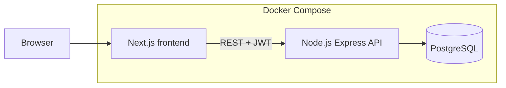
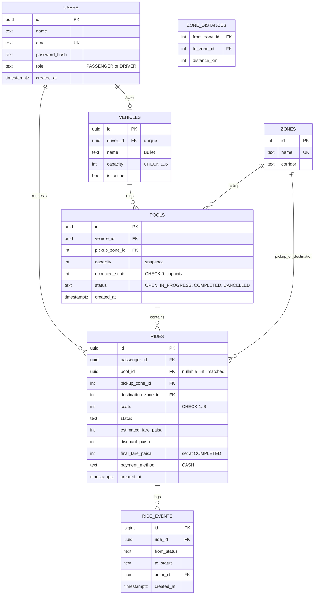

# Architecture, ERD and Concurrency

## Architecture



Single API, single database, no queues or caches. Business rules (state machine, matching, fare, capacity) live in the API service layer, not in route handlers and not in the frontend.

## Backend layers

routes (HTTP, validation with zod) then services (rules, transactions) then repositories (SQL). Auth middleware reads the JWT and attaches user id and role. Ownership checks happen in services.

## ERD



## Table notes

| Table | Why it exists |
|---|---|
| users | one table, role column, enough for passenger and driver |
| vehicles | capacity lives here, one vehicle per driver (unique driver_id), online flag |
| zones, zone_distances | predefined geography and distances, no map API |
| pools | one shared trip for one Tesla, tracks occupied seats |
| rides | one row per passenger request, holds individual status and fare |
| ride_events | append-only history so we can explain what happened later |

## Constraints and indexes

- CHECK (occupied_seats >= 0 AND occupied_seats <= capacity) on pools. This is the database-level seat guard.
- Partial unique index on pools(vehicle_id) WHERE status IN ('OPEN','IN_PROGRESS'): one active pool per Tesla.
- Partial unique index on rides(passenger_id) WHERE status IN ('REQUESTED','MATCHED','DRIVER_ARRIVED','STARTED'): one active ride per passenger.
- Index on rides(pool_id), rides(passenger_id, created_at DESC), ride_events(ride_id).
- All fares are INTEGER paisa.

## Concurrency: Nusrat and Shirin fight for the last seat

Problem: Bullet has 1 seat left. Both read "1 free", both try to take it.

Bad approach: read occupied seats, check in code, then update. Two requests can both pass the check.

Our approach: claim seats with one atomic conditional UPDATE inside a transaction.

```sql
UPDATE pools
SET occupied_seats = occupied_seats + $seats
WHERE id = $poolId
  AND status = 'OPEN'
  AND occupied_seats + $seats <= capacity
RETURNING id;
```

- Postgres row-locks the pool row for the duration of the UPDATE. The second request waits, then re-evaluates the WHERE against the new value and matches zero rows.
- Zero rows returned means no seat, so the API returns 409 and the ride stays REQUESTED (or Shirin is told the pool is full).
- If rows returned, the ride is set to MATCHED and a ride_event is written in the same transaction.
- The CHECK constraint is the safety net if any code path ever forgets the condition.
- Cancelling a ride decrements occupied_seats in the same transaction.

Test: fire two concurrent join requests (Nusrat and Shirin) at a pool with 1 free seat, assert exactly one succeeds and occupied_seats equals capacity.

At larger scale: per-vehicle serialization through a queue or a reservation with TTL in a fast store, plus idempotency keys on requests. Not needed for the MVP.

## Auth and security basics

bcrypt password hashes, JWT with expiry, role checks in middleware, ownership checks in services (a passenger can only read or cancel own rides), zod validation on every input, rate limit on auth routes, no secrets in git.

## Error handling

Consistent JSON error shape: status code, machine code, message. 400 validation, 401 unauthenticated, 403 forbidden or not owner, 404 not found, 409 invalid transition or no seats.