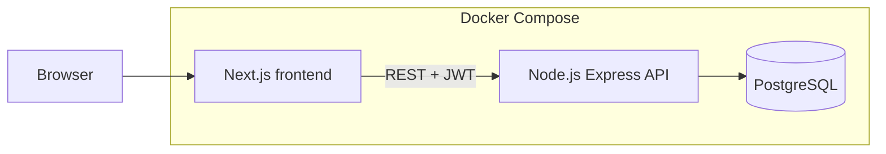
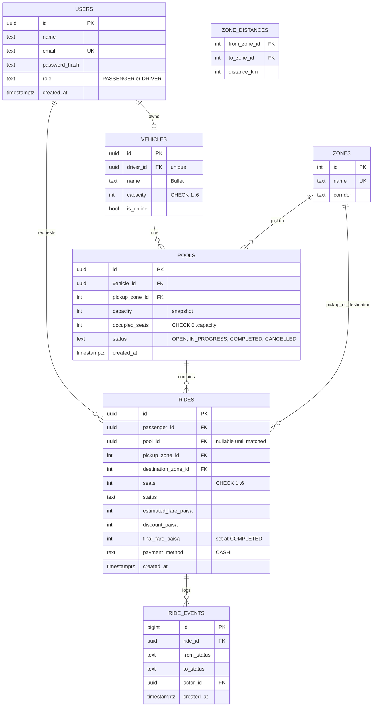

# Architecture, ERD and Concurrency

## Architecture

Single API, single database, no queues or caches. Business rules (state machine, matching, fare, capacity) live in the API service layer, not in route handlers and not in the frontend.

## Backend layers

routes (HTTP, validation with zod) then services (rules, transactions) then repositories (SQL). Auth middleware reads the JWT and attaches user id and role. Ownership checks happen in services.

## ERD

## Table notes

| Table | Why it exists |
|---|---|
| users | one table, role column, enough for passenger and driver |
| vehicles | capacity lives here, one vehicle per driver (unique driver_id), online flag |
| zones, zone_distances | predefined geography and distances, no map API |
| pools | one shared trip for one Tesla, tracks occupied seats |
| rides | one row per passenger request, holds individual status and fare |
| ride_events | append-only history so we can explain what happened later |

## Constraints and indexes

- CHECK (occupied_seats >= 0 AND occupied_seats <= capacity) on pools. This is the database-level seat guard.
- Partial unique index on pools(vehicle_id) WHERE status IN ('OPEN','IN_PROGRESS'): one active pool per Tesla.
- Partial unique index on rides(passenger_id) WHERE status IN ('REQUESTED','MATCHED','DRIVER_ARRIVED','STARTED'): one active ride per passenger.
- Index on rides(pool_id), rides(passenger_id, created_at DESC), ride_events(ride_id).
- All fares are INTEGER paisa.

## Concurrency: Nusrat and Shirin fight for the last seat

## Why raw SQL instead of an ORM

The rules that keep seats and rides consistent live in Postgres, so the API talks to Postgres directly through `pg`.

- The partial unique indexes (one active ride per passenger, one active pool per vehicle) and the `pools_seats_within_capacity` CHECK are written in the SQL migration. ORMs such as Prisma usually cannot express partial indexes in their schema language and need raw SQL for them anyway.
- The hot path uses `SELECT ... FOR UPDATE` in a fixed order (vehicle, ride, pool) and a guarded `UPDATE` (`occupied_seats + n <= capacity`). Plain SQL keeps that lock order visible and reviewable in `backend/src/repositories`.
- The schema is small, so hand-written repository functions stay short and every query can be read in one place.

Trade-offs: row types are written by hand instead of generated, and migrations are plain `.sql` files that Postgres applies only on a fresh volume (`docker compose down -v` resets them). A migration tool is a next step if the schema starts changing often.

Seats are claimed only when a driver accepts a ride, inside one transaction.
The transaction takes row locks in a fixed order: vehicle, then ride, then pool (all FOR UPDATE).

- Two accepts on the same Tesla queue on the vehicle row lock. The second one re-reads
  occupied_seats after the first commits and gets 409 if the seat is gone.
- Two drivers accepting the same ride queue on the ride row lock. The second sees a
  status other than REQUESTED and gets 409.
- The seat increment also carries a guard (occupied_seats + seats <= capacity), and the
  pools_seats_within_capacity CHECK is the last safety net.

Rule for future code: any path that touches these rows (cancel, start, complete) must
lock in the same order, or it risks a deadlock.

At larger scale: per-vehicle serialization through a queue or a reservation with TTL,
plus idempotency keys on requests.
## Auth and security basics

bcrypt password hashes, JWT with expiry, role checks in middleware, ownership checks in services (a passenger can only read or cancel own rides), zod validation on every input, rate limit on auth routes, no secrets in git.

## Error handling

Consistent JSON error shape: status code, machine code, message. 400 validation, 401 unauthenticated, 403 forbidden or not owner, 404 not found, 409 invalid transition or no seats.

## Security and logging

- Passwords are hashed with bcrypt. Tokens are signed JWTs, and every ride action checks the token's user and role in the service layer.
- `helmet` sets security headers. JSON bodies are capped at 10 KB.
- Login and register are rate limited per IP (default 30 per 15 minutes, `AUTH_RATE_LIMIT_MAX`). Counters live in API memory, which is fine for one instance. With several API instances they would move to a shared store such as Redis.
- Behind the Next.js proxy the API trusts one proxy hop (`trust proxy = 1`) so it sees the real client IP.
- Logs are one JSON line per request (method, path, status, ms, user id). Passwords and tokens are never logged.
- The API warns at startup if `JWT_SECRET` is still `change-me`. It does not refuse to boot, so `docker compose up` works without a `.env`. Set a real secret anywhere public.