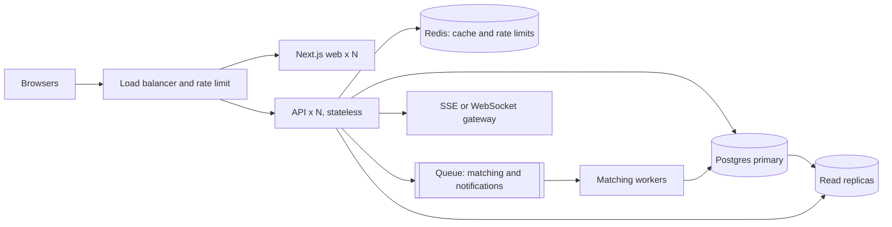

# Scaling notes: if Dhaka Tesla Pool goes viral

Scenario: 1M passengers, 100k drivers. Not built, only reasoned through. The MVP stays simple on purpose; here is what I would change, in the order the bottlenecks would appear.

**1. Stateless API behind a load balancer.** The API already keeps no session state (JWT), so I would run many instances. The in-memory rate limiter moves to a shared store (Redis), or to the gateway.

**2. Database first.** Postgres is the bottleneck, so:
- Read replicas for history and dashboards; writes stay on the primary.
- Indexes already match the hot queries (`pool_id`, `passenger_id + created_at`). Partition `ride_events` by time since it is append-only.
- Archive finished rides out of the hot tables.

**3. Contention on a single Tesla.** Row locks per vehicle are fine at MVP scale because contention is limited to one Tesla's passengers. At scale, serialize accepts per vehicle through a queue keyed by vehicle id, so one worker owns a Tesla's seat count, or use a reservation with a TTL. Keep the CHECK constraint as the last safety net.

**4. Geospatial matching.** Zones become geohash or H3 cells, with PostGIS for nearby-driver search. Drivers' live locations go in an in-memory geo index (Redis GEO), not in Postgres on every ping.

**5. Real-time.** Replace polling with websockets or SSE. Driver location and ride status flow through a pub/sub channel.

**6. Queues and events.** Move non-critical work off the request path (notifications, receipts, analytics) onto a queue. Emit ride events to a log so other services can consume them. Keep seat claiming synchronous.

**7. Idempotency and retries.** Every state-changing request gets an idempotency key so a retry after a timeout cannot double-book a seat or double-charge. Clients retry with backoff; the server dedupes on the key.

**8. Caching.** Zone and fare constants are cached in memory. Do not cache seat counts, since correctness matters more than speed there.

**9. Rate limiting and security.** Per-user and per-IP limits at the gateway, secrets in a secret manager, and short-lived tokens with refresh.

**10. Observability.** Structured logs already exist; add request ids, metrics (accept latency, 409 rate, seats claimed) and tracing, with alerts on error rate and DB lock waits.

**11. Deployment.** Containers behind a managed load balancer, blue/green or rolling deploys, and migrations run as a separate step before the new version goes live. Orchestration (Kubernetes) only when the number of services justifies it.

**12. Failure strategy.** Timeouts on every call, a circuit breaker around external services, and the driver or passenger can always cancel safely. If the matching service is down, requests stay REQUESTED and can be matched later.

The shape I would grow into, one step at a time, only when a number justifies it:

